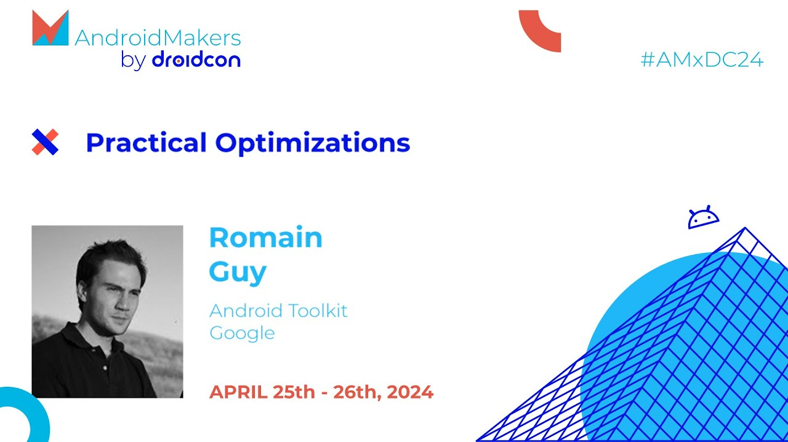

# Swift Explorer

Desktop tool to quickly explore and analyze Swift Intermediate Representation (IR) generated by the LLVM compiler, and also generate assembly code.

## Features

- <b>Deep Code Understanding:</b> Developers can see how Swift code is transformed into both LLVM IR and assembly code, helping them better understand optimization and low-level behavior.
- <b>Advanced Debugging:</b> Viewing LLVM IR and assembly can help identify performance issues or hard-to-trace bugs in source code.
- <b>Education and Learning:</b> A valuable educational tool for learning about compilers and how different language constructs translate into intermediate representation and assembly.
- <b>Optimization:</b> Helps identify and optimize code snippets that are not compiling efficiently by providing insights from both LLVM IR and assembly.
- <b>Comparative Analysis:</b> Allows you to compare how different approaches or code versions generate different IR and assembly code, facilitating the choice of best coding practices.

### Optimization flags

- `Onone:` Compile without any optimization.
- `Osize:` Compile with optimizations and target small code size.
- `Ounchecked:` Compile with optimizations and remove runtime safety checks.
- `O:` Compile with optimizations.

## Installing

Download the dmg - [click here](https://github.com/heroesofcode/swift-explorer/releases/download/2.0.0/SwiftExplorer.dmg)

## Inspiration

This project was inspired by [kotlin-explorer](https://github.com/romainguy/kotlin-explorer) developed by [Romain Guy](https://github.com/romainguy).

If you have any questions about the kotlin-explorer tool, I recommend you watch the talk **Practical Optimizations - Romain Guy**

## License

swift-explorer is released under the MIT license. See [LICENSE](https://github.com/heroesofcode/swift-explorer/blob/main/LICENSE) for details.
